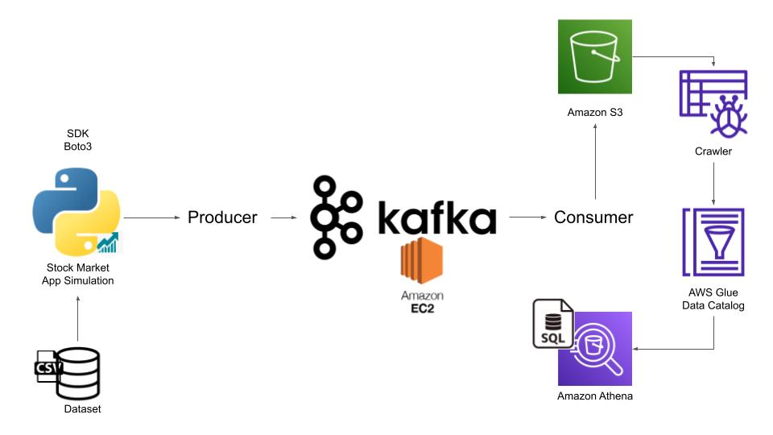

# Real Time Data Engineering on Stock Market Data using Apache Kafka

## Introduction 
In this project, I have implemented an End-To-End Data Engineering Project on Real-Time Stock Market Data using Kafka.

Here, I have used different technologies such as Python, Amazon Web Services (AWS), Apache Kafka, Glue, Athena, and SQL.

## Architecture 

## Dataset Used
Dataset - (https://github.com/harshadaabagal/StockMarket-RealTimeAnalysis-AWS-KafkaStreaming/blob/main/data/indexProcessed.csv)
